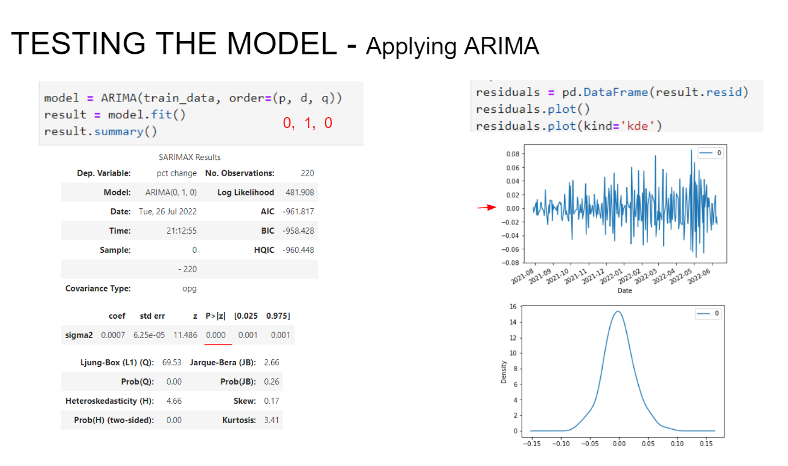
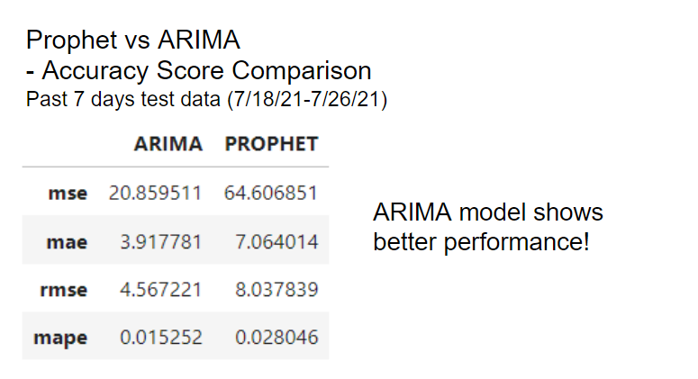

# FBProphet vs ARIMA

## Hypothesis
Using ARIMA learning tool, input stock price data and create short-term predictions for a particular stock. Using yfinance options pricing data we will compare against the predicted prices, calculating profit probability for various confidence levels of the predicted stock price. The end goal is to challenge our existing model (fbprophet) and determine which model is more accurate through backtesting.

## Technologies:
* [FB Prophet](https://facebook.github.io/prophet/) - procedure for forecasting time series data based on an additive model
* [YFinance](https://pypi.org/project/yfinance/) - open-source tool that uses Yahoo's publicly available API for stock/options data
* [scipy](https://scipy.org/) - Fundamental algorithms for scientific computing in Python
* [matplotlib](https://matplotlib.org/) - comprehensive library for creating static, animated, and interactive visualizations in Python
* [numpy](https://numpy.org/) - fundamental package for scientific computing with Python
* [hvplot](https://hvplot.holoviz.org/) - high-level plotting API for the PyData ecosystem built on HoloViews
* [holoview](https://holoviews.org/) - open-source Python library designed to make data analysis and visualization
* [pmdarima](https://pypi.org/project/pmdarima/) - statistical library designed to fill the void in Python's time series analysis capabilities

## Installation Guide
Before running the application first install the following dependencies:

```python
import pandas as pd
import yfinance as yf
from scipy.stats import norm
from matplotlib import pyplot as plt
import sklearn
from pathlib import Path
import csv
from prophet import Prophet

import numpy as np
import hvplot.pandas
import holoviews as hv
from holoviews import opts
hv.extension('bokeh')

from pandas.plotting import autocorrelation_plot
from statsmodels.tsa.arima.model import ARIMA
from pmdarima.arima import auto_arima
from statsmodels.graphics.tsaplots import plot_pacf
from statsmodels.tsa.stattools import adfuller
from statsmodels.graphics.tsaplots import plot_acf
from pmdarima.arima.utils import ndiffs

from statsmodels.tsa.statespace.sarimax import SARIMAX
from statsmodels.tsa.seasonal import seasonal_decompose 
from pmdarima import auto_arima 
from pandas import DataFrame
from math import sqrt
from statsmodels.graphics.tsaplots import plot_predict
from sklearn.metrics import mean_squared_error, mean_absolute_error

```

## Usage
To run the program, simply clone the repository, and go through the written steps in the *.ipynb file.

Results Screenshots:

ARIMA Model summary


ARIMA MSFT Projections


## Conclusion
We tested our models using 4 testing methods: 
* MSE (Mean Squared Error): When a model has no error, the MSE equals zero. As model error increases, its value increases.
* MAE (Mean Average Error): The average over the verification sample of the absolute values of the differences between forecast and the corresponding observation.
* RMSE (Root Mean Square Error): Represents the square root of the variance of the residuals.
it gives us an idea of the average distance between the observed data values and the predicted data values.
* MAPS (Mean Average Percentage Error): Expresses accuracy as a percentage of the error.

Overall, all 4 statistical testing methods shows that ARIMA has better performance than Prophet model.
### Accuracy Score (Prophet vs ARIMA)


## Next Steps
* Perform backtesting and compare models
* Consider other models to compare (neural network etc)
* Consider adding other factors - social media mentions, economy, sentiment, etc
* Consider comparing with seasoned trader
* Make program user friendly
* Build AWS bot for better user experience


## Contributors
Sungmoo Ban, Morgan Blackmore, Ryan Johnson, Jung Kim, Jennifer Taylor, Danica Valera


## License
MIT License
